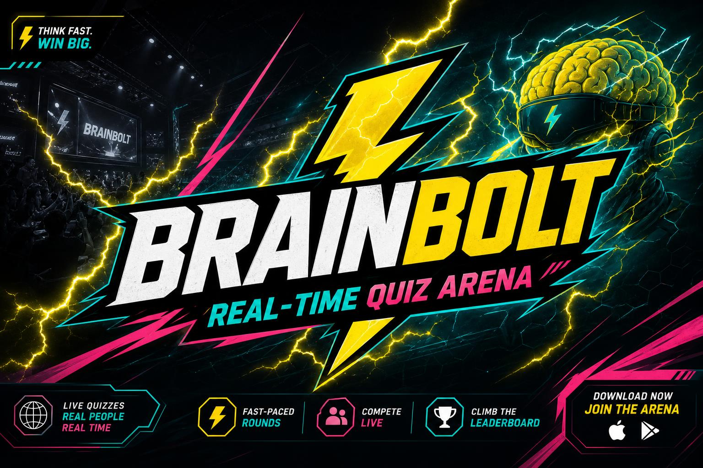

<div align="center">



# ⚡ BrainBolt — Real-Time Quiz Arena

**A broadcast-styled, real-time competitive quiz platform for classrooms, corporate training, conferences, communities, and recurring leagues.**

[](https://brain-bolt-arena.lovable.app)
[](#)
[](#)
[](https://react.dev)
[](https://tanstack.com/start)
[](https://www.typescriptlang.org/)
[](https://vitejs.dev/)
[](https://tailwindcss.com/)
[](https://supabase.com)
[](https://supabase.com/realtime)
[](#-license)
[](https://lovable.dev)

[**🎮 Live Demo**](https://brain-bolt-arena.lovable.app) • [**✨ Features**](#-core-features) • [**🧩 Question Types**](#-supported-question-types) • [**🚀 Quick Start**](#-local-development)

</div>

---

## 🧠 What is BrainBolt?

**BrainBolt** is a real-time, competitive quiz arena where a host runs a live session and players join from any device with a short room code. It blends the energy of live game shows with the depth of persistent leagues and team competitions.

It's built for:

- 🏫 **Classrooms** — engaging formative assessment and revision battles
- 🏢 **Corporate training & onboarding** — measurable knowledge checks with a bit of fun
- 🎤 **Conferences & meetups** — icebreakers, keynote polls, live trivia
- 🌐 **Communities & creators** — recurring trivia nights, Discord/Twitch events
- 🏆 **Leagues & tournaments** — season-long standings with persistent rankings

One host. Many players. Zero installs.

---

## ✨ Core Features

### 🎯 Quiz Engine
- Author unlimited quizzes with **10+ question types**
- Per-question time limits, point values, media, and correct-answer configs
- Inline question editor with reordering, duplication, and delete
- **Universal CSV import** covering every question type

### 📡 Live Hosting
- Real-time host dashboard with reveal, skip, and advance controls
- Optional auto-advance based on timer or "everyone answered"
- Live participant presence (joined / answered / idle)
- Short join codes and shareable `/join/<code>` links
- 5-second **Question Reveal** intro screen before every question

### 🏆 Player Experience
- Mobile-first, tap-to-answer UI
- Live rank indicator ("You're 3rd") without exposing the full leaderboard mid-game
- Streak tracking, accuracy stats, and per-question feedback
- **Premium shareable result card** (PNG) at the end of the quiz
- Collapsible question review after the final leaderboard

### 🥇 Leagues
- Group quizzes into recurring seasons
- Cumulative standings across all sessions in a season
- Public league hubs with team and player rankings

### 👥 Team Clash *(in progress)*
- Persistent team rosters across sessions
- Aggregated team scoring
- Captain / member roles

### 📊 Analytics
- Per-session results, per-player breakdown, per-question difficulty
- Streaks, accuracy, and leaderboard evolution

### 🤖 AI Quiz Generation *(roadmap)*
- Generate quizzes from a topic or a document via the Lovable AI Gateway

### 📱 Mobile Experience
- Optimized layouts for portrait phones
- Touch-friendly hit targets on all question types
- Map, ordering, and audio questions all fully mobile-usable

### 🔐 Security
- Email + Google OAuth via Supabase Auth
- Row-Level Security on every table
- Role-based permissions via a dedicated `user_roles` table (no client-side admin checks)
- Auth-gated routes under the `_authenticated` layout

### ⚡ Performance
- SSR + edge deployment on Cloudflare Workers
- TanStack Query with loader prefetching
- Realtime via Supabase Websockets (low-latency broadcast)

---

## 🧩 Supported Question Types

| # | Type | Description | Typical Use Case | Example |
|---|------|-------------|------------------|---------|
| 1 | **Multiple Choice** | Pick one correct answer from 2–4 options. | Fact recall, concept checks. | *"What does CPU stand for?"* → Central Processing Unit |
| 2 | **True / False** | Binary decision on a statement. | Myth-busting, quick concept checks. | *"The Great Wall of China is visible from space with the naked eye."* → False |
| 3 | **Text Answer** | Player types a short answer; multiple accepted variants supported. | Vocabulary, names, dates. | *"Capital of Australia?"* → Canberra |
| 4 | **Free Text Feedback** | Open-ended, unscored response. Always placed at the end of a quiz. | Feedback, opinions, discussion prompts. | *"What was your favorite moment today?"* |
| 5 | **Closest Number** | Numeric guess; closest player wins the most points. | Estimation, statistics, "how many". | *"How many bones in the human body?"* → 206 |
| 6 | **Map Pin** | Drop a pin on a world map; distance from the target determines the score. | Geography, landmarks, world events. | *"Where is Machu Picchu?"* → drop pin in Peru |
| 7 | **Image Reveal** | An image is progressively revealed; earlier answers score higher. | "Guess the…" rounds, brand/logo/character reveals. | *Blurred photo revealing a famous painting* |
| 8 | **Audio Question** | An audio clip plays once; players answer while it's playing. | Music, sound effects, language listening. | *Play 5s clip* → "Which song is this?" |
| 9 | **Ordering / Sequence** | Arrange items in the correct order. | Historical events, processes, rankings. | *Order these events chronologically: …* |
| 10 | **Matching / Pairing** *(experimental)* | Pair items from two columns. | Vocabulary, capitals, cause/effect. | *Match countries to capitals* |

> The **universal CSV template** downloadable from the quiz editor covers all types above with type-specific columns and safe fallbacks.

---

## 🖼️ Coming Soon: Interface Preview

Screenshots will be added here as the UI stabilizes. Placeholders below reserve their spots.

| View | Placeholder |
|------|-------------|
| Landing Page | `./docs/screenshots/landing.png` |
| Host Dashboard | `./docs/screenshots/host-dashboard.png` |
| Live Leaderboard | `./docs/screenshots/leaderboard.png` |
| Podium | `./docs/screenshots/podium.png` |
| Multiple Choice | `./docs/screenshots/mcq.png` |
| Audio Question | `./docs/screenshots/audio.png` |
| Image Reveal | `./docs/screenshots/image-reveal.png` |
| Map Question | `./docs/screenshots/map-pin.png` |
| Ordering Question | `./docs/screenshots/ordering.png` |
| Feedback Question | `./docs/screenshots/feedback.png` |
| League Standings | `./docs/screenshots/leagues.png` |
| Team Clash | `./docs/screenshots/team-clash.png` |

---

## 🕹️ Game Flow

```text
Landing Page
     ↓
  Join Code
     ↓
Avatar Selection
     ↓
Question Reveal  (≈5s intro)
     ↓
   Gameplay
     ↓
 Leaderboard
     ↓
   Podium
     ↓
  Share Card
     ↓
Question Review
```

---

## 🏟️ League System

BrainBolt Leagues turn one-off quizzes into ongoing competitions.

- **Recurring quizzes** — schedule a weekly or monthly quiz under a league
- **Season standings** — cumulative points across every session in the season
- **Persistent rankings** — players and teams keep their standing between sessions
- **Weekly competitions** — leaderboard resets per week, season, or all-time
- **Team Clash** *(in progress)* — teams accumulate combined points across sessions

---

## 🏗️ Architecture

```text
        ┌────────────────────┐
        │  Player Devices    │
        │  (mobile / web)    │
        └─────────┬──────────┘
                  │
        ┌─────────▼──────────┐
        │  React 19 + TanStack Start │
        │  (SSR on Cloudflare Workers) │
        └─────────┬──────────┘
                  │
    ┌─────────────┼─────────────┐
    │             │             │
┌───▼───┐   ┌─────▼─────┐   ┌───▼──────┐
│ Auth  │   │ Realtime  │   │ Postgres │
│(OAuth)│   │(Websocket)│   │  + RLS   │
└───────┘   └───────────┘   └──────────┘
        Supabase (Lovable Cloud)
```

---

## 🛠️ Tech Stack

| Layer | Technology |
|-------|------------|
| **Frontend** | React 19, TanStack Router/Query |
| **Framework** | TanStack Start v1 (SSR + server functions) |
| **Build** | Vite 7, Bun |
| **Language** | TypeScript (strict) |
| **Styling** | Tailwind CSS v4, shadcn/ui, Radix UI |
| **Icons** | lucide-react |
| **Maps** | Leaflet (labelless political map) |
| **Charts** | Recharts |
| **Image Export** | html-to-image (share card) |
| **Backend** | Supabase (Lovable Cloud) |
| **Realtime** | Supabase Realtime (Websockets) |
| **Database** | PostgreSQL with Row-Level Security |
| **Authentication** | Supabase Auth (Email + Google OAuth) |
| **Deployment** | Cloudflare Workers (edge runtime) |

---

## 🗂️ Folder Structure

```
src/
├── routes/                    # File-based routing (TanStack Start)
│   ├── __root.tsx             # Root layout + head metadata
│   ├── index.tsx              # Landing page
│   ├── auth.tsx               # Sign in / sign up
│   ├── dashboard.tsx          # Host dashboard
│   ├── quizzes.$id.tsx        # Quiz editor + CSV import
│   ├── host.$sessionId.tsx    # Live host control panel
│   ├── play.$sessionId.tsx    # Player game view
│   ├── join.$code.tsx         # Join by code
│   ├── leagues.tsx            # Leagues index
│   ├── leagues.$id.tsx        # League detail
│   └── debug.map.tsx          # Map debug harness
├── components/                # Reusable UI (question types, host shell, share card…)
├── hooks/                     # use-auth-user, use-mobile, …
├── lib/                       # Game logic, formatting, timing helpers
├── integrations/supabase/     # Auto-generated Supabase client + helpers
└── styles.css                 # Design tokens (Tailwind v4)
supabase/
└── migrations/                # SQL schema + RLS policies
public/
├── banner.jpg
└── favicon.ico
```

---

## 🚀 Local Development

### Prerequisites
- [Bun](https://bun.sh) ≥ 1.1
- Node.js 20+ (for tooling compatibility)
- A Supabase project (free tier is fine)

### Setup

```bash
# 1. Clone
git clone https://github.com/<your-username>/brain-bolt-arena.git
cd brain-bolt-arena

# 2. Install
bun install

# 3. Configure environment
cp .env.example .env
# Fill in the values described below

# 4. Run the dev server
bun run dev

# 5. Production build
bun run build

# 6. Preview the production build
bun run preview
```

---

## 🔐 Environment Variables

| Variable | Purpose |
|----------|---------|
| `VITE_SUPABASE_URL` | Public Supabase project URL used by the browser client |
| `VITE_SUPABASE_PUBLISHABLE_KEY` | Public (anon/publishable) Supabase key for the browser client |
| `VITE_SUPABASE_PROJECT_ID` | Optional Supabase project ref used by tooling |

> Never commit secret keys. Server-only secrets (if you add integrations) belong in the deployment environment, not in `VITE_*` variables.

---

## 📋 CSV Import

BrainBolt ships with a **universal CSV template** that supports every question type. The importer is forgiving with headers — spaces, casing, and underscores are normalized, and irrelevant columns are safely ignored per row.

Minimal multiple-choice example:

```csv
question_type,question,option_a,option_b,option_c,option_d,correct_answer,time_limit,points
multiple_choice,What does CPU stand for?,Central Processing Unit,Computer Personal Unit,Central Power Unit,Core Process Unit,A,20,100
```

Type-specific columns include: `accepted_answers` (text), `numeric_answer` (closest number), `map_latitude` / `map_longitude` (map pin), `audio_url` (audio), `image_url` (image reveal / MCQ), `items` (ordering), etc. Download the template + README bundle from the quiz editor for the full spec.

---

## 🗺️ Roadmap

- [ ] AI question generation (topic → quiz, document → quiz)
- [ ] Downloadable achievement certificates
- [ ] Full **Team Clash** mode with team standings
- [ ] Multi-season **League** archives
- [ ] Premium hosting tier (larger rooms, branding)
- [ ] Payments & subscriptions
- [ ] Native mobile app (iOS / Android)
- [ ] Public quiz marketplace with ratings and remixing

---

## 🤝 Contributing

Contributions are welcome!

1. Open an issue describing the change you'd like to make.
2. Fork the repo and create a feature branch.
3. Follow the existing code style (TypeScript strict, Tailwind tokens, no hardcoded colors).
4. Ensure `bun run build` succeeds.
5. Open a PR with a clear description and screenshots for UI changes.

For substantial features (new question types, league mechanics, etc.), please discuss in an issue first.

---

## 📜 License

Released under the [MIT License](LICENSE).

---

<div align="center">

**Built with ⚡ on [Lovable](https://lovable.dev)**

</div>
